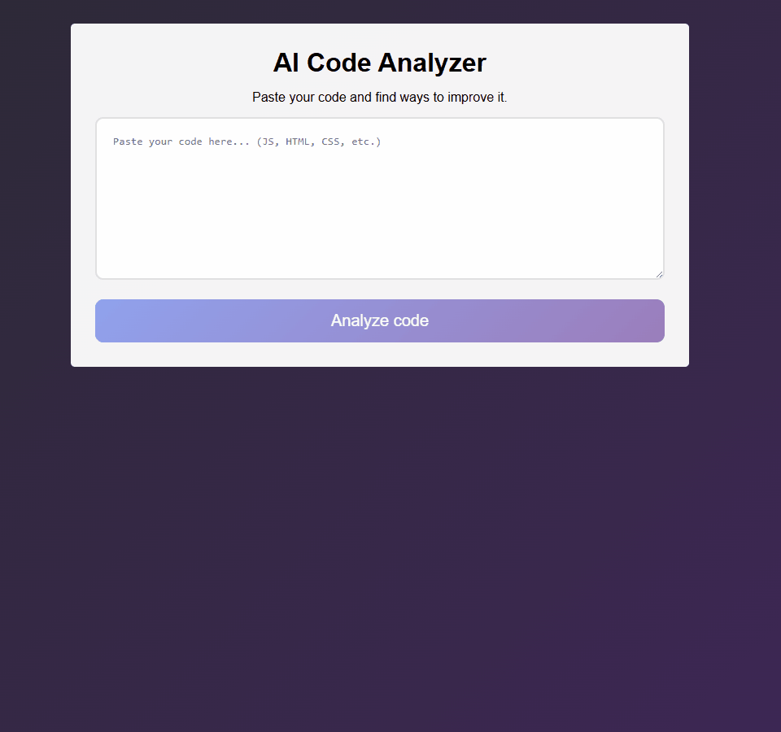

<h1 align="center"> AI Code Analyzer ⏳</h1>

<p align="center">
<a href="#-screenshots">Screenshots</a>&nbsp;&nbsp;&nbsp;|&nbsp;&nbsp;&nbsp;
<a href="#-technologies">Technologies</a>&nbsp;&nbsp;&nbsp;|&nbsp;&nbsp;&nbsp;
<a href="#-features">Features</a>&nbsp;&nbsp;&nbsp;|&nbsp;&nbsp;&nbsp;
<a href="#-how-to-run">How to Run</a>&nbsp;&nbsp;&nbsp;|&nbsp;&nbsp;&nbsp;
<a href="#-license">License</a>&nbsp;&nbsp;&nbsp;|&nbsp;&nbsp;&nbsp;
<a href="#-contributing">Contributing</a>&nbsp;&nbsp;&nbsp;|&nbsp;&nbsp;&nbsp;
<a href="#support">Support</a>
</p>

<p align="center">
  
</p>

<br>

## 📸 Screenshots



<br>

## 🛠 Technologies

- HTML5  
- CSS3  
- JavaScript (Vanilla)  
- React 18
- Vite (build tool moderno)
- Gemini
- CSS Modules
- Hooks (useState, useEffect, useCallback)  
- Git and GitHub

<br>

## ✨ Features

- Automated Code Analysis – Uses Artificial Intelligence to identify issues, optimizations, and patterns in the source code.
- Multi-Language Support – Compatible with languages like JavaScript, Python, Java, and more (customizable).
- Bad Practice Detection – Finds code snippets that don’t follow best development practices.
- Improvement Suggestions – Provides intelligent recommendations to improve code efficiency and readability.

<br>


## ⚙ How to Run

### Requirements

- [Node.js](https://nodejs.org/) (version 18 or newer recommended)
- [npm](https://www.npmjs.com/) or [yarn](https://yarnpkg.com/) (npm comes with Node.js)
- [Git](https://git-scm.com/)

### Steps

1. **Clone the repository**:

   ```bash
   git clone https://github.com/Chrysthy/AI-code-analyzer.git
   cd AI-code-analyzer
   ```

2. **Install dependencies**:

   ```bash
   npm install
   # or
   yarn install
   ```

3. **Run the development server**:

   ```bash
   npm run dev
   # or
   yarn dev
   ```

4. **Open in your browser**:

   ```
   http://localhost:5173
   ```

<br>

## 📜 License

* This project is licensed under the [MIT License](https://choosealicense.com/licenses/mit/)

<br>

